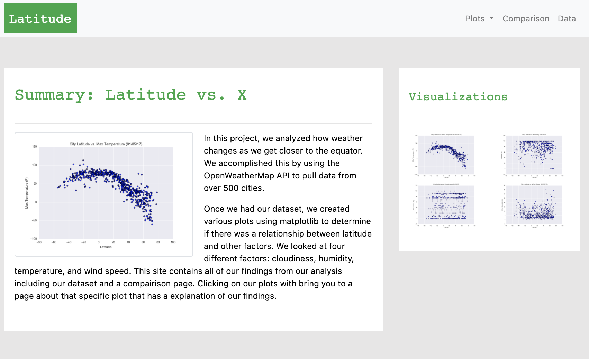
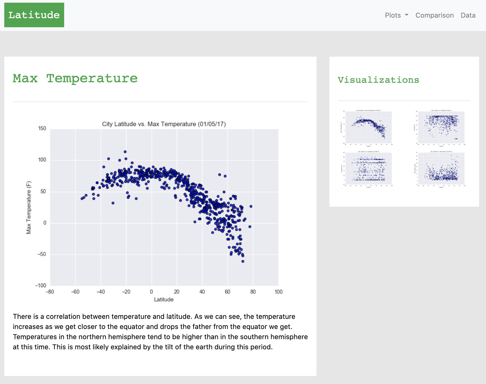
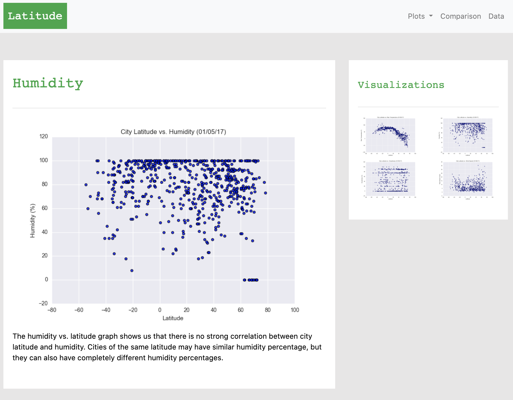
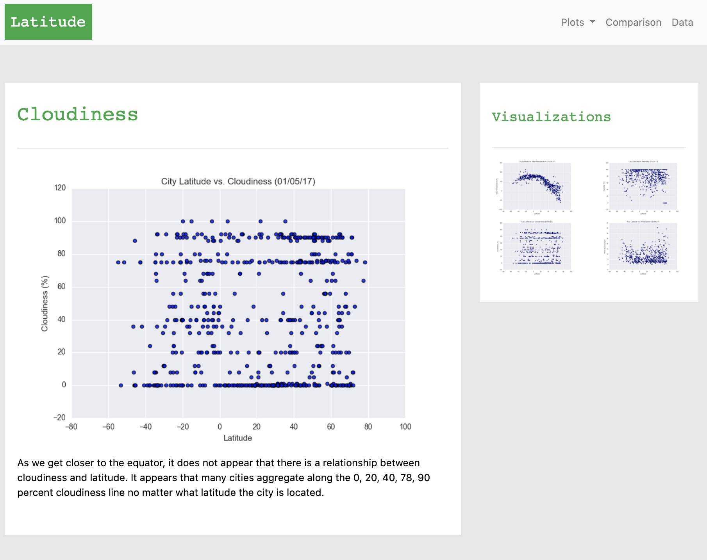
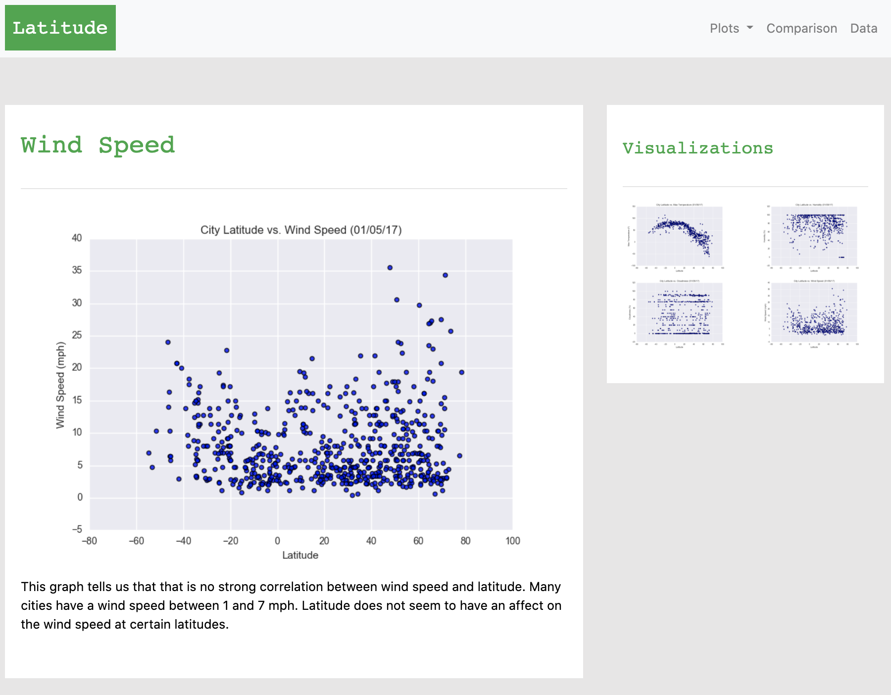
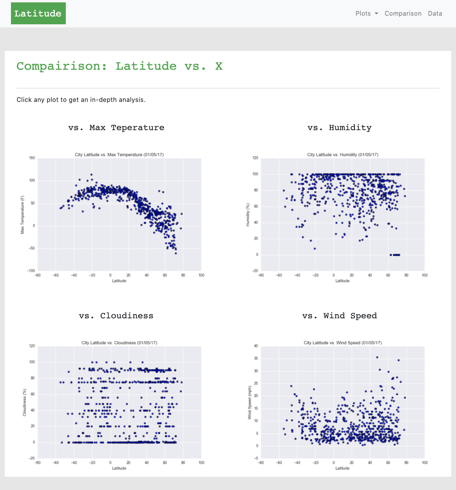
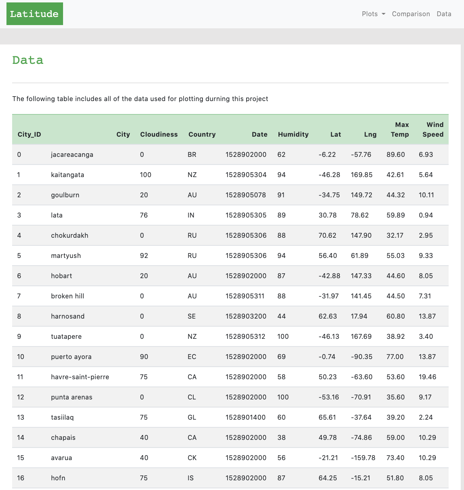

# Web-Design-Challenge

## Background

Data is more powerful when we share it with others! Let's take what we've learned about HTML and CSS to create a dashboard showing off the analysis we've done.

## Web Visualizations

* A [landing page](#landing-page) containing:
  * An explanation of the project.
  * Links to each visualizations page.
  * Drop down menu that contains the links for the visualization pages

  

* Four [visualization pages](#visualization-pages), each with:
  * A descriptive title and heading tag.
  * The plot/visualization itself for the selected comparison.
  * A paragraph describing the plot and its significance.

  

  

  

  

* A ["Comparisons" page](#comparisons-page) that:
  * Contains all of the visualizations on the same page so we can easily visually compare them.

  

* A ["Data" page](#data-page) that:
  * Displays a responsive table containing the data used in the visualizations.

  
